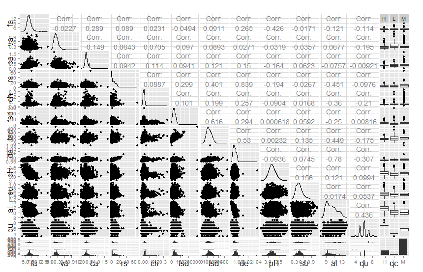
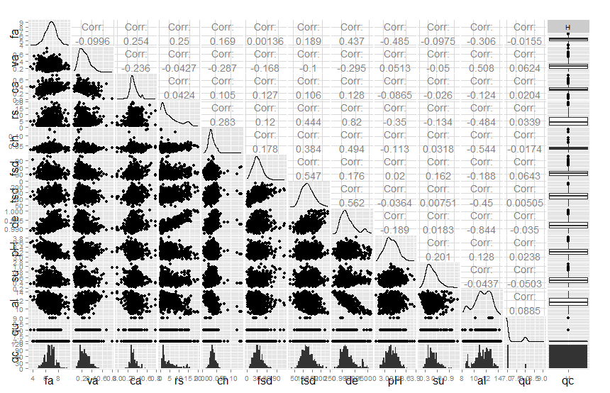

---
output:
  html_document:
    fig_height: 8
    fig_width: 12
---
White Wine Quality Analysis by Richard Haughton
========================================================

```{r echo=FALSE, message=FALSE, warning=FALSE, packages}
# import all of the required libraries
# set the working directory
# load the data set

#
# Notice that the parameter "echo" was set to FALSE for this code chunk.
# This prevents the code from displaying in the knitted HTML output.
# You should set echo=FALSE for all code chunks in your file.

library(ggplot2)
library(tidyr)
library(dplyr)
library(scales)
library(psych)
library(gridExtra)
library(GGally)

setwd("C:/Users/Rick/Documents/nanodegree/p3-dataanalysiswithr/project")

wines <- read.csv('wineQualityWhites.csv')
```

```{r echo=FALSE, message=FALSE, warning=FALSE, udfs}
# Variety of UDF's to reduce code replication

# function to prepare a freqpoly for a given feature split by a categorical
# feature with categories H,M,L
#
# purpose here is simply to reduce duplicated code somewhat. clearly it
# could be further generalised to split by arbitrary categorical features and
# apply different stylings
freqpolyByHMLCategory <- function(vinos, xfeature, hmlcategory){

  # use of aes_string to enable variable definition of x and color features
  # http://stackoverflow.com/questions/15458526/r-pass-variable-column-names-to-ggplot2
  
  # use of [] syntax to subset based upon variable (rather than subset function)
  #http://stackoverflow.com/questions/17075529/r-subset-based-on-variable-column-name
  
  return(
    ggplot() +
    geom_freqpoly(aes_string( x = xfeature,
                              y = "..count../sum(..count..)",
                              color = hmlcategory),
                              data = vinos[vinos[,hmlcategory] == 'L',]) +
    geom_freqpoly(aes_string( x = xfeature,
                              y = "..count../sum(..count..)",
                              color = hmlcategory),
                              data = vinos[vinos[,hmlcategory] == 'H',]) +
    geom_freqpoly(aes_string( x = xfeature,
                              y = "..count../sum(..count..)",
                              color = hmlcategory),
                              data = vinos[vinos[,hmlcategory] == 'M',]) +
    scale_y_continuous(labels = percent_format())
  )
}
```

# Univariate Plots Section

## Basic Structure
```{r echo=FALSE, message=FALSE, warning=FALSE, Univariate_Plots}

options(width=100)

# what is the size of the data set
dim(wines)

# check the column names
names(wines)

# get a structural overview of the data
str(wines)

# get an overview of the shape of each column
summary(wines)
describe(wines)

# take a peak at the data
head(wines)
```

* 4898 rows, 13 columns - 1 id column (represents a wine under test), 11 
features and 1 output variable (quality)
* All input features are +ve numerical, the output variable is ordinal taking 
values 0 - 10 (though 3 is the min observed and 9 max)


## Histogram individual features

Omitting some features that appeared less interesting for brevity:

* citric.acid
* free.sulfur.dioxide
* sulphates

### quality

```{r echo=FALSE, message=FALSE, warning=FALSE, histogram_quality, fig.width=6,fig.height=4}

# lets look at our output variable first - quality
table(wines$quality)

ggplot(aes(x = quality), data = wines) + 
  geom_histogram(color = 'white', fill = "dodgerblue2", binwidth = 1)

# lets categorise quality a bit - [0-4] = L, [5,6] = M, [7-] = "H"
wines$quality.category <- ifelse(wines$quality >= 7,"H",
                                 ifelse(wines$quality >=5, "M","L"))

wines$quality.category <- factor(wines$quality.category, levels=c("L","M","H"))
table(wines$quality.category)

```

* normalish distribution
* introduced a categorical variable with 'low <5', 'med 5,6', 'high >6', might 
be useful later rather having to compare each quality level

###fixed.acidity
```{r echo=FALSE, message=FALSE, warning=FALSE, histogram_fixed.acidity, fig.width=6,fig.height=4}
describe(wines$fixed.acidity)

ggplot(aes(x = fixed.acidity), data = wines) +
  geom_histogram(color = "darkblue", fill = "dodgerblue2",binwidth = 0.1) +  
  coord_cartesian(xlim = c(min(wines$fixed.acidity),max(wines$fixed.acidity)))
```

* nicely normal distribution, few outliers

### volatile.acidity
```{r echo=FALSE, message=FALSE, warning=FALSE, histogram_volatile_acidity, fig.height=4}  
describe(wines$volatile.acidity)

a = ggplot(aes(x  = volatile.acidity), data = wines) +
  geom_histogram(color = "darkblue", fill = "dodgerblue2")

b = ggplot(aes(x = volatile.acidity, 
               y = ..count../sum(..count..)), data = wines) +
  geom_histogram(color = "darkblue", fill = "dodgerblue2", binwidth = 0.02) +
  scale_y_continuous(labels = percent_format()) + 
  coord_cartesian(xlim = c(min(wines$volatile.acidity),
                           max(wines$volatile.acidity)))  +
  scale_x_continuous(
    breaks = seq(min(wines$volatile.acidity), max(wines$volatile.acidity), 0.1))

grid.arrange(a,b, ncol = 2)
```

* right skewed
* Leptokurtic - kurtosis > 3, peaky with thicker tail than normal

### residual.sugar
```{r echo=FALSE, message=FALSE, warning=FALSE, histogram_residual_sugar, fig.height=4}  
describe(wines$residual.sugar)

#a = ggplot(aes(x  = residual.sugar), data = wines) +
#  geom_histogram(color = "darkblue", fill = "dodgerblue2")

## looks like 1 or more outliers way right lets look at some percentiles
#quantile(wines$residual.sugar, c(0.1,0.2,0.3,0.4,0.5,0.6,0.7,0.8,0.9,0.99,1.0))

## given the 99 percentile limit x to 99 percentile
b = ggplot(aes(x = residual.sugar, fill = factor(quality)), data = wines) +
  geom_histogram(color = "darkblue", binwidth = 0.25) +
    coord_cartesian(xlim = c(min(wines$residual.sugar),
                             quantile(wines$residual.sugar,0.99))) +
  theme(legend.position="top")
  
## try this one with a log10 x, cos there's a long tail right
c = ggplot(aes(x  = residual.sugar, 
               y = ..count../sum(..count..)), data = wines) +
  geom_histogram(color = "darkblue", fill = "dodgerblue2") +  
  scale_y_continuous(labels = percent_format()) +  
  scale_x_log10() +
  theme(legend.position="top")

grid.arrange(b,c, ncol = 2)
```

* looks extreme right skewed (very long tail right)
* some absurd outliers well away from the norm
* log x plot appears bi-modal which if nothing more shows that the long tail 
accounts for a significant proportion of the data

### chlorides
```{r echo=FALSE, message=FALSE, warning=FALSE, histogram_chlorides, fig.width=6,fig.height=4}  
describe(wines$chlorides)

ggplot(aes(x  = chlorides), data = wines) +
  geom_histogram(color = "darkblue", fill="dodgerblue2", binwidth = 0.002)
```

* really high kurtosis, so very definitely Leptokurtik
* also right skewed

### total_sulfur_dioxide
```{r echo=FALSE, message=FALSE, warning=FALSE, histogram_total_sulfur_dioxide, fig.height=4}  
describe(wines$total.sulfur.dioxide)

a = ggplot(aes(x  = total.sulfur.dioxide), data = wines) +
  geom_histogram(color = "darkblue", fill = "dodgerblue2")

## looks like one or more outliers way off to the right lets look at percentiles
quantile(wines$total.sulfur.dioxide, c(.1,.2,.3,.4,.5,.6,.7,.8,.9,.99,1.0))

## so a long tail so let limit our x
b = ggplot(aes(x  = total.sulfur.dioxide), data = wines) +
  geom_histogram(colour = "darkblue", fill="dodgerblue2", binwidth = 1) +
    scale_x_continuous(       
      breaks = seq(min(wines$total.sulfur.dioxide), 
                   max(wines$total.sulfur.dioxide), 10)) +
  coord_cartesian(xlim = c(0,quantile(wines$total.sulfur.dioxide,0.99)))

grid.arrange(a,b, ncol = 2)
```

* pretty normal?

### density
```{r echo=FALSE, message=FALSE, warning=FALSE, histogram_density, fig.height=4}  
describe(wines$density)
summary(wines$density)

a = ggplot(aes(x  = density), data = wines) +
  geom_histogram(color = "darkblue", fill = "dodgerblue2")

b = ggplot(aes(x  = density), data = wines) +
  geom_histogram(colour = "darkblue", fill="dodgerblue2", binwidth = 0.001) +
    scale_x_continuous(       
      breaks = seq(0.98, max(wines$density), 0.002)) +
  coord_cartesian(xlim = c(min(wines$density),quantile(wines$density, 0.999)))

grid.arrange(a,b, ncol = 2)
```

* high kurtosis?

### pH
```{r echo=FALSE, message=FALSE, warning=FALSE, histogram_pH, fig.height=4}  
describe(wines$pH)

a = ggplot(aes(x  = pH), data = wines) +
  geom_histogram(color = "darkblue", fill = "dodgerblue2")

b = ggplot(aes(x  = pH), data = wines) +
  geom_histogram(color = "darkblue", fill = "dodgerblue2", binwidth = 0.01) +
    scale_x_continuous(       
      breaks = seq(2.7, max(wines$pH), 0.05)) +
  coord_cartesian(xlim = c(min(wines$pH),max(wines$pH)))

grid.arrange(a,b, ncol = 2)
```

* pretty normal

### alcohol
```{r echo=FALSE, message=FALSE, warning=FALSE, histogram_alcohol, fig.height=4}  

# alcohol
summary(wines$alcohol)
describe(wines$alcohol)

a = ggplot(aes(x  = alcohol), data = wines) +
  geom_histogram(color = "darkblue", fill = "dodgerblue2")

## only way I could get Knit HTML to accept a finer binwidth is as follows:
r <- range(wines$alcohol)
bwidth <- (r[2] - r[1]) / 60

b = ggplot(aes(x  = alcohol), data = wines) +
  geom_histogram(color = "darkblue", fill = "dodgerblue2", binwidth = bwidth)

grid.arrange(a,b, ncol = 2)
```

* bit right skewed
* Platykurtic given the low (in fact negative) kurtosis

## Individual features by quality

Use a variety of plot types to get an indication of whether a given feature 
varies significantly with quality

Ommiting several features that appeared less interesting for brevity:

* citric.acid
* free.sulfur.dioxide
* sulphates

### fixed.acidity
```{r echo=FALSE, message=FALSE, warning=FALSE, boxplot_fixed_acidity, fig.height=5}
# share some properties, namely where to stash the legend
base <- ggplot() + theme(legend.position="top")

# setup the boxplot against quality
a <- base + geom_boxplot(aes(x=factor(quality), y=fixed.acidity, 
                                    color=quality), data = wines) +
  scale_y_continuous(breaks = seq(0,max(wines$fixed.acidity),1))

## now focus upon the bulk of the data
b <- a + coord_cartesian(ylim = c(6,9))

# histogram individual properties with a facet wrap of quality.category
c <- base + 
  geom_histogram(aes(x = fixed.acidity, fill = quality.category), data = wines,
                 color = "darkblue") +
  facet_wrap(~quality.category, ncol = 1, scales = "free_y")

# freqpoly - palmed off to a function to save repetition
d <- freqpolyByHMLCategory(wines, 'fixed.acidity', 'quality.category') +
    theme(legend.position="top")

# show it
grid.arrange(a,b,c,d, ncol = 4)
```

* allways take quality 3 and 9 readings with a pinch of salt as there are 
relatively few of them
* I'd say no conclusive difference with quality
* freqpoly suggests lower quality wines have higher fixed.acidity more often

### volatile.acidity
```{r echo=FALSE, message=FALSE, warning=FALSE, boxplot_volatile_acidity, fig.height=5}
# share some properties, namely where to stash the legend
base <- ggplot() + theme(legend.position="top")

##look at the lot
a <- base + geom_boxplot(aes(x=factor(quality), y=volatile.acidity, 
                                    color=quality), data = wines) +
  scale_y_continuous(breaks = seq(0,max(wines$volatile.acidity),0.1))

## now focus upon the bulk of the data
b <- a + coord_cartesian(ylim = c(0.08,0.75))

# histogram individual properties with a facet wrap of quality.category
c <- base + 
  geom_histogram(aes(x = volatile.acidity, y = ..count../sum(..count..), 
          fill = quality.category), data = wines, color = "darkblue") +
  facet_wrap(~quality.category, ncol = 1, scales = "free_y")

# freqpoly - palmed off to a function to save repetition
d <- freqpolyByHMLCategory(wines, 'volatile.acidity', 'quality.category') +
    theme(legend.position="top")

# show it
grid.arrange(a,b,c,d, ncol = 4)
```

* some evience that lower quality wines have higher volatile.acidity
* not too much to show between med and high quality

### residual.sugar
```{r echo=FALSE, message=FALSE, warning=FALSE, boxplot_residual_sugar, fig.height=5}
# share some properties, namely where to stash the legend
base <- ggplot() + theme(legend.position="top")

##look at the lot
a <- base + geom_boxplot(aes(x=factor(quality), y=residual.sugar, 
                                    color=quality), data = wines) +
  scale_y_continuous(breaks = seq(0,max(wines$residual.sugar),1))


## now focus upon the bulk of the data
b <- a + coord_cartesian(ylim = c(0,25))

# histogram individual properties with a facet wrap of quality.category
c <- base + 
  geom_histogram(aes(x = residual.sugar, fill = quality.category), 
                 data = wines, color = "darkblue", binwidth = 0.5) +
  scale_x_continuous(breaks = seq(0, 25, 1)) +
  coord_cartesian(xlim = c(0,25)) +
  facet_wrap(~quality.category, ncol = 1, scales = "free_y") +
  theme(legend.position="top")

# freqpoly - palmed off to a function to save repetition
d <- freqpolyByHMLCategory(wines, 'residual.sugar', 'quality.category') +
    theme(legend.position="top")

grid.arrange(a,b,c,d, ncol = 4)
```

* a suggestion here that high quality wines have lower residual.sugar than 
average wines
* not sure how to interpret low quality wines also having lower residual.sugar
* each category retains the bi-modal(ish) distribution of the whole sample

### chlorides
```{r echo=FALSE, message=FALSE, warning=FALSE, boxplot_chlorides, fig.height=5}
# share some properties, namely where to stash the legend
base <- ggplot() + theme(legend.position="top")

##look at the lot
a <- base + geom_boxplot(aes(x=factor(quality), y=chlorides, 
                                    color=quality), data = wines) +
  scale_y_continuous(breaks = seq(0,max(wines$chlorides),0.01))

## now focus upon the bulk of the data
b <- a + coord_cartesian(ylim = c(0.01,0.06))

## finally look at the outliers
c <- a + coord_cartesian(ylim = c(0.06,max(wines$chlorides)))

# histogram individual properties with a facet wrap of quality.category
#ggplot(aes(x = chlorides, fill = quality.category), data = wines) +
#  geom_histogram(color = "darkblue", binwidth = 0.001) +
#  scale_x_continuous(breaks = seq(0, 0.4, 0.01)) +
#  coord_cartesian(xlim = c(0,quantile(wines$chlorides, c(0.99)))) +
#  facet_wrap(~quality.category, ncol = 1, scales = "free_y")

# freqpoly - constructed this way to show proportions within each category
d <- freqpolyByHMLCategory(wines, 'chlorides', 'quality.category') +
    theme(legend.position="top")

grid.arrange(a,b,c,d, ncol = 4)
```

* looks like a strong(ish) suggestion that higher quality wines have lower 
chlorides albeit not by much!
* (almost 50 percent of 7,8 graded wines are less than the 25 percentile of 
grade 5,6)

### total.sulfur.dioxide
```{r echo=FALSE, message=FALSE, warning=FALSE, boxplot_total_sulfur_dioxide, fig.height=5}
# share some properties, namely where to stash the legend
base <- ggplot() + theme(legend.position="top")

##look at the lot
a <- base + geom_boxplot(aes(x=factor(quality), y=total.sulfur.dioxide, 
                                    color=quality), data = wines) +
  scale_y_continuous(breaks = seq(0,max(wines$chlorides),10))

## now focus upon the bulk of the data
b <- a + coord_cartesian(ylim = c(10,310))

c <- base + 
  geom_histogram(aes(x = total.sulfur.dioxide, fill = quality.category), 
                 data = wines, color = "darkblue", binwidth = 2) +
  scale_x_continuous(breaks = seq(0, 300, 10)) +
  coord_cartesian(xlim = c(0,quantile(wines$total.sulfur.dioxide, c(0.99)))) +
  facet_wrap(~quality.category, ncol = 1, scales = "free_y")

# freqpoly - constructed this way to show proportions within each category
d <- freqpolyByHMLCategory(wines, 'total.sulfur.dioxide', 'quality.category') +
    theme(legend.position="top")

grid.arrange(a,b,c,d, ncol = 4)
```

* possibly lower levels for higher quality wines?
* perhaps more accurately the concentration of values for high quality wines is 
more compact arount the low 100's

### density
```{r echo=FALSE, message=FALSE, warning=FALSE, boxplot_density, fig.height=5}
# share some properties, namely where to stash the legend
base <- ggplot() + theme(legend.position="top")

# setup the boxplot against quality
a <- base + geom_boxplot(aes(x=factor(quality), y=density, 
                                    color=quality), data = wines) +
  scale_y_continuous(breaks = seq(0.98,max(wines$density),0.01))

## now focus upon the bulk of the data
b <- a + coord_cartesian(ylim = c(0.985,1.005))

# histogram individual properties with a facet wrap of quality.category
c <- base + 
  geom_histogram(aes(x = density, fill = quality.category), data = wines,
                 color = "darkblue", binwidth = 0.0005) +
  coord_cartesian(xlim = c(0.985,quantile(wines$density, c(0.999)))) +
  facet_wrap(~quality.category, ncol = 1, scales = "free_y")

# freqpoly - palmed off to a function to save repetition
d <- freqpolyByHMLCategory(wines, 'density', 'quality.category') +
    theme(legend.position="top")

# show it
grid.arrange(a,b,d, ncol = 4)
```

* fairly strong suggestion that lower density = better quality

### pH
```{r echo=FALSE, message=FALSE, warning=FALSE, boxplot_pH, fig.height=5}
# share some properties, namely where to stash the legend
base <- ggplot() + theme(legend.position="top")

# setup the boxplot against quality
a <- base + geom_boxplot(aes(x=factor(quality), y=pH, 
                                    color=quality), data = wines) +
  scale_y_continuous(breaks = seq(0,max(wines$pH),0.1))

## now focus upon the bulk of the data
b <- a + coord_cartesian(ylim = c(2.8,3.7))

# histogram individual properties with a facet wrap of quality.category
c <- base + 
  geom_histogram(aes(x = pH, fill = quality.category), 
                 data = wines, color = "darkblue") +
  facet_wrap(~quality.category, ncol = 1, scales = "free_y")

# freqpoly - palmed off to a function to save repetition
d <- freqpolyByHMLCategory(wines, 'pH', 'quality.category') +
    theme(legend.position="top")

# show it
grid.arrange(a,b,c,d, ncol = 4)
```

* weak indication that higher pH = higher quality
* facet_wrap suggests it's very weak


### alcohol
```{r echo=FALSE, message=FALSE, warning=FALSE, boxplot_alcohol, fig.height=5}
# share some properties, namely where to stash the legend
base <- ggplot() + theme(legend.position="top")

# setup the boxplot against quality
a <- base + geom_boxplot(aes(x=factor(quality), y=alcohol, 
                                    color=quality), data = wines) +
  scale_y_continuous(breaks = seq(0,max(wines$alcohol),0.25))

## now focus upon the bulk of the data
b <- a + coord_cartesian(ylim = c(9,13))

# histogram individual properties with a facet wrap of quality.category
c <- base + 
  geom_histogram(aes(x = alcohol, fill = quality.category), 
                 data = wines, color = "darkblue", binwidth = .1) +
  scale_x_continuous(breaks = seq(8, 18, 1)) +    
  facet_wrap(~quality.category, ncol = 1, scales = "free_y")


# freqpoly - palmed off to a function to save repetition
d <- freqpolyByHMLCategory(wines, 'alcohol', 'quality.category') +
    theme(legend.position="top")

# show it
grid.arrange(a,b,c,d, ncol = 4)
```

* strong suggestion that high alcohol contributes heavily to high quality

# Univariate Analysis

### What is the structure of your dataset?

See above

### What is/are the main feature(s) of interest in your dataset?

* residual.sugar - Interesting due to it's long thick tail, compared to the 
other features with some suggestion that it is in fact bi-modal. Some suggestion 
that higher quality wines have lower levels than average wines

* alcohol - By far the clearest indicator of quality, with higher alcohol 
content indicating higher quality. Also the distribution was much more 
Platykurtic compared with the other input variables which mostly tended to be 
Leptokurtic

(Suspect there is a relationship between high alcohol and low residual.sugar?)

* chlorides - Looks like higher quality wines have lower chloride levels

* density - Looks like higher quality wines have lower density

### What other features in the dataset do you think will help support your investigation into your feature(s) of interest?

* fixed and volatile acidity might be useful to 'weed out' low quality wines
* similar for free.sulfur.dioxide

### Did you create any new variables from existing variables in the dataset?

Not exactly but I did create a variation of the output variable - 
quality.category

Rather than have to consider all 10 possible quality levels I instead had 3
categories (Low, Med, High) to simplify analysis

### Of the features you investigated, were there any unusual distributions? Did you perform any operations on the data to tidy, adjust, or change the form of the data? If so, why did you do this?

residual.sugar had a long thick tail, so I performed a log 10 transformation 
which enabled me to get a clearer idea of where the bulk of the data lay.  
As well as a large peak around 2(ish) there was a shorter/fatter (but roughly 
equal in size) peak around 10.

# Bivariate Plots Section

## Bi-variate matrix

Produce a bi-variate matrix to show correlation/distribution between each pair
of features to steer further analysis.  Produce a matrix for all the data and
then again for just the higher quality wines to see (if) how they vary.

This takes ages to produce, so I pre-prepared images (and commented out code):

### All Qualities


### High Quality


```{r echo=FALSE, message=FALSE, warning=FALSE, ggpairs}

# we can do a full x vs y analysis using ggpairs
# note it takes so long that I'll only run it once!
#abbrev = c("fa", "va", "ca", "rs", "ch", "fsd", "tsd", "de", "pH", "su", "al", "qu", "qc")
#ggpairs(wines[,2:14], columnLabels = abbrev)

# do it also just for the high quality wines
#highqwines = subset(wines, quality.category == "H")
#ggpairs(highqwines[,2:14], columnLabels = abbrev)
```

I will use this output to choose which bi and multi variate plots to produce

## Quality vs Individual Input Features

Scatter plots to compare individual features against quality.

Omitting several features for brevity:

* fixed.acidity
* citric.acid
* free.sulfur.dioxide
* pH
* sulphates

### quality vs volatile.acidity

```{r echo=FALSE, message=FALSE, warning=FALSE, quality_vs_volatile.acidity, fig.width=6, fig.height=4}

ggplot(aes(x = quality, y = volatile.acidity), data = wines) + 
  geom_point(alpha = 0.2, position = position_jitter(h = 0), color = 'green') +
  geom_line(color = "blue", stat = 'summary', fun.y = mean) + 
  geom_line(color = "lightblue", stat = 'summary', fun.y = median) +   
  geom_line(color = "red", linetype = 2, stat = 'summary', 
            fun.y = quantile, probs = .1) +
  geom_line(color = "red", linetype = 2, stat = 'summary', 
            fun.y = quantile, probs = .9) +
  scale_x_continuous(limits = c(3,9), breaks = seq(3, 9, 1)) +
  scale_y_continuous(limits = c(0,0.7), breaks = seq(0, 0.7, 0.1))

cor.test(wines$quality, wines$volatile.acidity, method = 'pearson') # -0.19
cor.test(wines$quality, wines$volatile.acidity, method = 'spearman') # -0.2
```

* no real correlation

### quality vs residual.sugar

```{r echo=FALSE, message=FALSE, warning=FALSE, quality_vs_residual.sugar, fig.width=6, fig.height=4}

# residual.sugar
ggplot(aes(x = quality, y = residual.sugar), data = wines) + 
  geom_point(alpha = 0.2, position = position_jitter(h = 0), color = 'brown') +
  geom_line(color = "blue", stat = 'summary', fun.y = mean) + 
  geom_line(color = "lightblue", stat = 'summary', fun.y = median) +   
  geom_line(color = "red", linetype = 2, stat = 'summary', 
            fun.y = quantile, probs = .1) +
  geom_line(color = "red", linetype = 2, stat = 'summary', 
            fun.y = quantile, probs = .9) +
  scale_x_continuous(limits = c(3,9), breaks = seq(3, 9, 1)) +
  scale_y_continuous(limits = c(0,20), breaks = seq(0, 20, 1))

cor.test(wines$quality, wines$residual.sugar, method = 'pearson') # -0.098
cor.test(wines$quality, wines$residual.sugar, method = 'spearman') # -0.082
```

* interesting to see that the median/mean are a lot higher than the highest
  density residual.sugar values
* still seeing a reduction for higher quality wines
* looks like there should be a stronger correlation because there is a drop
off from medium to high quality wines. could it be the low quality (value 3 - 4)
which are hiding the trend?

### quality vs chlorides

```{r echo=FALSE, message=FALSE, warning=FALSE, quality_vs_chlorides, fig.width=6, fig.height=4}

# chlorides
ggplot(aes(x = quality, y = chlorides), data = wines) + 
  geom_point(alpha = 0.1, position = position_jitter(h = 0), color = 'red') +
  geom_line(color = "blue", stat = 'summary', fun.y = mean) + 
  geom_line(color = "lightblue", stat = 'summary', fun.y = median) +   
  geom_line(color = "red", linetype = 2, stat = 'summary', 
            fun.y = quantile, probs = .1) +
  geom_line(color = "red", linetype = 2, stat = 'summary', 
            fun.y = quantile, probs = .9) +
  scale_x_continuous(limits = c(3,9), breaks = seq(3, 9, 1)) + 
  scale_y_continuous(limits = c(0,0.1), breaks = seq(0, 0.1, 0.01))

cor.test(wines$quality, wines$chlorides, method = 'pearson') # -0.2
cor.test(wines$quality, wines$chlorides, method = 'spearman') # -0.3
```

* moderate correlation (with spearman anyway)
* possible interesting group of high chlorides for quality = 8

### quality vs total.sulfur.dioxide

```{r echo=FALSE, message=FALSE, warning=FALSE, quality_vs_total.sulfur.dioxide, fig.width=6, fig.height=4}

# total.sulfur.dioxide
ggplot(aes(x = quality, y = total.sulfur.dioxide), data = wines) + 
  geom_point(alpha = 0.2, position = position_jitter(h = 0), color = 'black') +
  geom_line(color = "blue", stat = 'summary', fun.y = mean) + 
  geom_line(color = "lightblue", stat = 'summary', fun.y = median) +   
  geom_line(color = "red", linetype = 2, stat = 'summary', 
            fun.y = quantile, probs = .1) +
  geom_line(color = "red", linetype = 2, stat = 'summary', 
            fun.y = quantile, probs = .9) +
  scale_x_continuous(limits = c(3,9), breaks = seq(3, 9, 1)) +
  scale_y_continuous(limits = c(25,250), breaks = seq(25, 250, 25))

cor.test(wines$quality, wines$total.sulfur.dioxide, method = 'pearson') # -0.17
cor.test(wines$quality, wines$total.sulfur.dioxide, method = 'spearman') # -0.2

## bit of a wild suggestion but I reckon that without the free.sulfur.dioxide,
## the remaining sulfur.dioxide would have a significant correlation
```

### quality vs density

```{r echo=FALSE, message=FALSE, warning=FALSE, density, fig.width=6, fig.height=4}

# density
ggplot(aes(x = quality, y = density), data = wines) + 
  geom_point(alpha = 0.2, position = position_jitter(h = 0), color = 'maroon') +
  geom_line(color = "blue", stat = 'summary', fun.y = mean) + 
  geom_line(color = "lightblue", stat = 'summary', fun.y = median) +   
  geom_line(color = "red", linetype = 2, stat = 'summary', 
            fun.y = quantile, probs = .1) +
  geom_line(color = "red", linetype = 2, stat = 'summary', 
            fun.y = quantile, probs = .9) +
  scale_x_continuous(limits = c(3,9), breaks = seq(3, 9, 1)) +
  scale_y_continuous(limits = c(0.987,1.003), breaks = seq(0.987, 1.003, 0.001))

cor.test(wines$quality, wines$density, method = 'pearson') # -0.31
cor.test(wines$quality, wines$density, method = 'spearman') # -0.348
```

* fairly clear that most high quality wines have lower density
(again we think this is directly because of the low density of alcohol)
* still looks to me like a small cluster of higher quality wines with high 
density

### quality vs alcohol

```{r echo=FALSE, message=FALSE, warning=FALSE, quality_vs_alcohol, fig.width=6, fig.height=4}

# alcohol
ggplot(aes(x = quality, y = alcohol), data = wines) + 
  geom_point(alpha = 0.1, position = position_jitter(h = 0), 
             color = 'firebrick4') +
  geom_line(color = "blue", stat = 'summary', fun.y = mean) + 
  geom_line(color = "lightblue", stat = 'summary', fun.y = median) +   
  geom_line(color = "red", linetype = 2, stat = 'summary', 
            fun.y = quantile, probs = .1) +
  geom_line(color = "red", linetype = 2, stat = 'summary', 
            fun.y = quantile, probs = .9) +
  scale_x_continuous(limits = c(3,9), breaks = seq(3, 9, 1))

cor.test(wines$quality, wines$alcohol, method = 'pearson') # 0.44
cor.test(wines$quality, wines$alcohol, method = 'spearman') # 0.44
```

* confirmed as the strongest relationship to quality
* look at quality = 8, clear air gap between the main cluster of 'high alcohol'
  wines and a smaller cluster of 'low alcohol' wines
  
# Bivariate Analysis

### Talk about some of the relationships you observed in this part of the investigation. How did the feature(s) of interest vary with other features in the dataset?

(more on this in the Multivariate section)

* confirmed that there is a strong positive correlation between alcohol and
quality. 

* surprised by the very small correlation between residual.sugar and quality.
Curiously it looks like (on average) levels of residual.sugar start low for low
quality wines, rise for medium quality wines and dip again as we move into high
quality wines. What if anything does this suggest?

* it's beginning to look like there is a recipe for creating higher quality
wines that is something like:

  + High alcohol levels ~(11 - 14)
  + Low residual.sugar ~(1 - 3)
  + Low chloride levels ~(0.03 - 0.045)
  + (possibly) Lower levels of total.sulfur.dioxide

(I'm ignoring density because I think it is a direct consequence of levels of 
the above)

* there is just a hint that there is an alternative recipe for higher quality
wines (difficult to confirm given the relatively small number of samples):

  + Lower alcohol levels ~(8.5 - 9)
  + High levels of residual.sugar ~(14 - 16)
  + Higher levels of chloride ~(0.06)

### Did you observe any interesting relationships between the other features (not the main feature(s) of interest)?

* strong +ve correlation between total.sulfur.dioxide and density and 
corresponding strong -ve correlation between total.sulfur.dioxide and alcohol

* Surprised that whilst we observe a strong -ve correlation between 
fixed.acidity and pH (as you might expect) there is little to no relationship 
between volatile.acidity and pH

### What was the strongest relationship you found?

Strongest relationship between a feature and the output variable (quality) was
for 'alcohol' with (Pearson) correlation of 0.436

Overall the strongest correlation was between residual.sugar and density with
(Pearson) correlation of 0.839. Closely followed by alcohol and density 
(-0.78).


# Multivariate Plots Section

## Input Feature vs Input Feature split on quality.category

Look for correlations between input variables, start with those that seem to 
have a significant impact upon quality and indeed split by quality (to provide
a third and thus multivariate plot)

### chlorides vs alcohol
```{r echo=FALSE, message=FALSE, warning=FALSE, chlorides_vs_alcohol}
a = ggplot(aes(x = chlorides, 
               y = alcohol, 
               color = quality.category), data = wines) +
  geom_point(alpha = 0.2, position = position_jitter()) +
  coord_cartesian(xlim = c(0.01, 0.075)) +
  geom_smooth() +
  facet_wrap(~quality.category, ncol = 1, scales = "free_y")  

b = ggplot(aes(x = chlorides, 
               y = alcohol, 
               color = quality.category,
               shape = quality.category), data = wines) +
  geom_point(alpha = 0.2, position = position_jitter()) +
  coord_cartesian(xlim = c(0.01, 0.075)) +
  geom_smooth()

grid.arrange(a,b, ncol = 2)

cor.test(wines$chlorides, wines$alcohol, method = 'pearson') # -0.36
cor.test(wines$chlorides, wines$alcohol, method = 'spearman') # -0.57
```

* is there a suggestion that 'low alcohol' + 'high chlorides' = high quality?
* bit worried that there are only 'few' samples of high chlorides, skewing?
* the pattern though, alcohol increases as chlorides decrease seems consistent
  accross quality categories

### density vs alcohol

```{r echo=FALSE, message=FALSE, warning=FALSE, density_vs_alcohol}
a = ggplot(aes(x = density, 
               y = alcohol, 
               color = quality.category), data = wines) +
  geom_point(alpha = 0.1, position = position_jitter()) +
  coord_cartesian(xlim = c(0.987, 1.001)) +
  geom_smooth() +
  facet_wrap(~quality.category, ncol = 1, scales = "free_y")  

b = ggplot(aes(x = density, 
               y = alcohol, 
               color = quality.category,
               shape = quality.category), data = wines) +
  geom_point(alpha = 0.1, position = position_jitter()) +
  coord_cartesian(xlim = c(0.987, 1.001)) +
  geom_smooth()

grid.arrange(a,b, ncol = 2)

cor.test(wines$density, wines$alcohol, method = 'pearson') # -0.78
cor.test(wines$density, wines$alcohol, method = 'spearman') # -0.82
```

* very high correlation, this post suggests causation
https://answers.yahoo.com/question/index?qid=20130520032820AAdgLx6
* i.e. high alcohol lowers density cos alcohol has lower density than water

### residual.sugar vs alcohol

```{r echo=FALSE, message=FALSE, warning=FALSE, residual.sugar_vs_alcohol}
a = ggplot(aes(x = residual.sugar, 
               y = alcohol, 
               color = quality.category), data = wines) +
  geom_point(alpha = 0.2, position = position_jitter()) +
  coord_cartesian(xlim = c(0, 20), ylim = c(5,15)) +
  geom_smooth() +
  facet_wrap(~quality.category, ncol = 1, scales = "free_y")  

b = ggplot(aes(x = residual.sugar, 
               y = alcohol, 
               color = quality.category, 
               shape = quality.category), data = wines) +
  geom_point(alpha = 0.2, position = position_jitter()) +
  coord_cartesian(xlim = c(0, 20)) +
  geom_smooth()

grid.arrange(a,b, ncol = 2)

cor.test(wines$residual.sugar, wines$alcohol, method = 'pearson') # -0.45
cor.test(wines$residual.sugar, wines$alcohol, method = 'spearman') # -0.45  
```  

* again we see that there is a cluster (albeit small) of high quality wines and 
see that there looks like:

  + low alcohol + high sugar = high quality

* hard to see because there are so many medium quality wines but the density of
high quality wines with alocohol 11 - 14 and residual.sugar < 5 combined with
the ggsmooth line illustrates that this is the sweetspot. it is also telling 
that there are comparatively few low and medium quality wines in this range

### volatile.acidity vs alcohol

```{r echo=FALSE, message=FALSE, warning=FALSE, volatile.acidity_vs_alcohol}

# volatile.acidity vs alcohol
a = ggplot(aes(x = volatile.acidity, 
               y = alcohol, 
               color = quality.category), data = wines) +
  geom_point(alpha = 0.1, position = position_jitter()) +
  coord_cartesian(xlim = c(0.1, 0.5)) +
  geom_smooth() +
  facet_wrap(~quality.category, ncol = 1, scales = "free_y")

b = ggplot(aes(x = volatile.acidity, 
               y = alcohol, 
               color = quality.category,
               shape = quality.category), data = wines) +
  geom_point(alpha = 0.1, position = position_jitter()) +
  coord_cartesian(xlim = c(0.1, 0.5)) +
  geom_smooth()

grid.arrange(a,b, ncol = 2)

highwines = wines %>% filter(quality.category == "H")
cor.test(highwines$volatile.acidity, highwines$alcohol, method = 'pearson') #0.5

```
* so virtually no correlation for low/med quality wines
* a strong positive correlation for high quality wines
* this is the strongest difference in relationship between features accross
qualities
* note that a similar treatment of fixed.acidity vs alcohol gave a similar but
less extreme result this time with a correlation of -0.3 (note negative) for 
high quality wines

### density vs chlorides

```{r echo=FALSE, message=FALSE, warning=FALSE, density_vs_chlorides}
a = ggplot(aes(x = density, 
               y = chlorides, 
               color = quality.category), data = wines) +
  geom_point(alpha = 0.2, position = position_jitter()) +
  coord_cartesian(xlim = c(0.987, 1.001), ylim = c(0.01, 0.075)) +
  geom_smooth() +
  facet_wrap(~quality.category, ncol = 1, scales = "free_y")  

b = ggplot(aes(x = density, 
               y = chlorides, 
               color = quality.category,
               shape = quality.category), data = wines) +
  geom_point(alpha = 0.2, position = position_jitter()) +
  coord_cartesian(xlim = c(0.987, 1.001), ylim = c(0.01, 0.075)) +
  geom_smooth()

grid.arrange(a,b, ncol = 2)

cor.test(wines$density, wines$chlorides, method = 'pearson') # -0.257
cor.test(wines$density, wines$chlorides, method = 'spearman') # -0.508
```

* perhaps, more chlorides directly increases density? certainly see an increase
accross the quality ranges
* can we say that density shows alcohol and chlorides re-inforcing
each other?

### residual.sugar vs fixed.acidity

Article discussing relationhsip between alcohol and r.s also suggests you need 
high acidity with high sugar

http://drinks.seriouseats.com/2013/04/wine-jargon-what-is-residual-sugar-riesling-fermentation-steven-grubbs.html

```{r echo=FALSE, message=FALSE, warning=FALSE, residual.sugar_vs_fixed.acidity}

# residual.sugar vs fixed.acidity
a = ggplot(aes(x = residual.sugar, 
               y = fixed.acidity, 
               color = quality.category), data = wines) +
  geom_point(alpha = 0.1, position = position_jitter()) +
  coord_cartesian(xlim = c(0, 20), ylim = c(5, 8)) +
  geom_smooth() +
  facet_wrap(~quality.category, ncol = 1, scales = "free_y")

b = ggplot(aes(x = residual.sugar, 
               y = fixed.acidity, 
               color = quality.category,
               shape = quality.category), data = wines) +
  geom_point(alpha = 0.1, position = position_jitter()) +
  coord_cartesian(xlim = c(0, 20), ylim = c(5, 8)) +
  geom_smooth()

grid.arrange(a,b, ncol = 2)

# correlation for all wines
cor.test(wines$residual.sugar, wines$fixed.acidity, method = 'pearson') # -0.08
cor.test(wines$residual.sugar, wines$fixed.acidity, method = 'spearman') # -0.11

# now consider just high quality wines as there is asuggestion of a different 
# distribution
highwines = wines %>% filter(quality.category == "H")
cor.test(highwines$residual.sugar, highwines$fixed.acidity, method = 'pearson') 
# 0.25
```

[residual.sugar vs fixed.acidity]

* so a much stronger (albeit still smallish), positive correlation for 
high quality wines
* when sugar is low, acidity seems to vary widely
* when sugar is higher, acidity seems to be higher and there is a smallish 
but not insignificant cluster of higher quality wines when suger is higher
and acidity is higher

[residual.sugar vs volatile.acidity]

for completeness I also checked res.sug against volatile.acidity, 
this showed virtually no correlation for any quality

### pH vs fixed.acidity

```{r echo=FALSE, message=FALSE, warning=FALSE, pH_vs_fixed.acidity}

# pH vs fixed.acidity
a = ggplot(aes(x = pH, 
               y = fixed.acidity, 
               color = quality.category), data = wines) +
  geom_point(alpha = 0.5, position = position_jitter()) +
  coord_cartesian(xlim = c(2.8, 3.7), ylim = c(4.5,10.5)) +
  geom_smooth() +
  facet_wrap(~quality.category, ncol = 1, scales = "free_y")

b = ggplot(aes(x = pH, 
               y = fixed.acidity, 
               color = quality.category,
               shape = quality.category), data = wines) +
  geom_point(alpha = 0.5, position = position_jitter()) +
  coord_cartesian(xlim = c(2.8, 3.7), ylim = c(4.5,10.5)) +
  geom_smooth()

grid.arrange(a,b, ncol = 2)

cor.test(wines$pH, wines$fixed.acidity, method = 'pearson') # -0.43
```

* srong negative correlation accross all quality categories
* intuitively makes sense given pH is a measure of acidity 
(with higher acid at lower pH).
* Apparently though there is no "direct connection between total acidity and pH" 
- http://en.wikipedia.org/wiki/Acids_in_wine

### residual.sugar vs total.sulfur.dioxide

```{r echo=FALSE, message=FALSE, warning=FALSE, residual.sugar_vs_total.sulfur.dioxide}
a = ggplot(aes(x = residual.sugar, 
               y = total.sulfur.dioxide, 
               color = quality.category), data = wines) +
  geom_point(alpha = 0.1, position = position_jitter()) +
  coord_cartesian(xlim = c(0, 20), ylim = c(50,200)) +
  geom_smooth() +
  facet_wrap(~quality.category, ncol = 1, scales = "free_y")

b = ggplot(aes(x = residual.sugar, 
               y = total.sulfur.dioxide, 
               color = quality.category,
               shape = quality.category), data = wines) +
  geom_point(alpha = 0.1, position = position_jitter()) +
  coord_cartesian(xlim = c(0, 20), ylim = c(50,200)) +
  geom_smooth()

grid.arrange(a,b, ncol = 2)

cor.test(wines$residual.sugar, wines$total.sulfur.dioxide, method = 'pearson') 
# -0.4
```

* again fairly strong positive correlation for all qualities
* again we see 2 clusters of high quality
  + main - low res.sug and variable total.sulfur.dioxide
  + minor - high res.sug & high total.sulfur.dioxide

# Multivariate Analysis

### Talk about some of the relationships you observed in this part of the investigation. Were there features that strengthened each other in terms of looking at your feature(s) of interest?

[chlorides vs alcohol]

During the bi-variate section it looked like:

* Big cluster of high quality wines with 'high alcohol'
* similarly, Big cluster of high quality wines with 'low chlorides'

* Smaller cluster of high quality wines with 'low alcohol'
* similarly, Smaller cluster of high quality wines with 'high chlorides'

The multivariate plot between chlorides and alcohol re-inforces this suspision,
it looks like we see

* high alcohol + low chlorides = high quality (large cluster of this)
* low alcohol + low chlorides = high quality (smaller cluster of this)
* medium alcohol + medium chlorides = medium quality (very large cluster)

[residual.sugar vs alcohol]

We appear to be seeing similar behaviour for these two:

* high alcohol + low residual.sugar = high quality (large cluster of this)
* low alcohol + high residual.sugar = high quality (smaller cluster of this)

It's less clear medium (and low) quality wines fall between these clusters

(please note: the '=' is misleading because of course there are also lower
quality wines that follow the same pattern)

### Were there any interesting or surprising interactions between features?

* The strong positive correlation between volatile.acidity and alcohol for
higher quality wines was surprising given there was virtually no correlation
for lower and medium quality wines

* Surprised me that when we look at high quality wines only we see a fairly
significant +ve relationship between volatile.acidity and alcohol whilst a
-ve corraltion between fixed.acidity and alcohol:
  + volatile.acidity vs alcohol = 0.5
  + fixed.acidity vs alcohol = -0.3

### OPTIONAL: Did you create any models with your dataset? Discuss the strengths and limitations of your model.

NO

------

# Final Plots and Summary

## The biggest single contributor to the quality of wine is ..... alcohol!

```{r echo=FALSE, Plot_One, fig.height=6}
# save typing errors for plot labels
alcohol_lab <- "density (% by volume)"

# share some properties, namely where to stash the legend
base <- ggplot() + theme(legend.position="top")

# setup the boxplot against quality
a <- base + geom_boxplot(aes(x=factor(quality), y=alcohol, 
                                    color=quality), data = wines) +
  scale_y_continuous(breaks = seq(0,max(wines$alcohol),0.25)) +
  ylab(alcohol_lab) + xlab("quality")

## now focus upon the bulk of the data
b <- a + coord_cartesian(ylim = c(9,13))

# histogram individual properties with a facet wrap of quality.category
c <- base + 
  geom_histogram(aes(x = alcohol, fill = quality.category), 
                 data = wines, color = "darkblue", binwidth = .1) +
  scale_x_continuous(breaks = seq(8, 18, 1)) +    
  facet_wrap(~quality.category, ncol = 1, scales = "free_y") +
   ylab("wine count") + xlab(alcohol_lab)  

# freqpoly - palmed off to a function to save repetition
d <- freqpolyByHMLCategory(wines, 'alcohol', 'quality.category') +
    theme(legend.position="top") + ylab("% wines") + xlab(alcohol_lab)    

# note, missing c. For some reason c fails when I run knit (not when run direct)
# textGrob courtesy - http://r.789695.n4.nabble.com/Styling-gridExtra-s-title-and-left-labels-td4639388.html
grid.arrange(a,b,c,d, ncol = 4, 
          main = textGrob("Alcohol Breakdown by Quality", gp=gpar(fontsize=18)))
```

Alcohol is by far the single biggest contributor to the quality of white wine
(in this sample). As a crude measure it has a correlation (Pearson) value of 
0.436, over twice as much as the next most significant (chlorides at -0.21)

The boxplots show quite clearly the marked increase in quality as you increase
the level of alcohol, with a sweetspot between around 11 to 13.

The histogram and frequency polygon both show that the distribution 
of low and medium quality wines is 'quite similar' whereas (as expected) the
distribution of high quality wines is noticeably right shifted (higher alcohol).

It's also worth noting that there is a smaller peak of higher quality wines
with lower alcohol content (around 9%). So, we have:

* large cluster of high quality wines with high alcohol (11 - 13)
* small cluster of high quality wines with low alcohol (~9)

A similar pattern could be observed for certain other features. For example:

* residual.sugar
+ large cluster of high quality wines with low residual.sugar
+ small cluster of high quality wines with high residual.sugar

* chlorides
+ large cluster of high quality wines with low chlorides
+ small cluster of high quality wines with high chlorides

We'll look at how these contribute together towards the quality of wine in the
following plots

## The recipe for a high quality wine is .....

```{r echo=FALSE, Plot_Two, fig.height=18}
# save typing errors for plot labels
residual_sugar_lab <- "residual.sugar (g / dm^3)"
chlorides_lab <- "chlorides (sodium chloride - g / dm^3)"
alcohol_lab <- "(% by volume)"

# consider chlorides vs alcohol
a = ggplot(aes(x = chlorides, 
               y = alcohol, 
               color = quality.category), data = wines) +
  geom_point(alpha = 0.1, position = position_jitter()) +
  coord_cartesian(xlim = c(0.01, 0.075)) +
  geom_smooth() +
  facet_wrap(~quality.category, ncol = 1, scales = "free_y") +
  ylab(alcohol_lab) + xlab(chlorides_lab)

b = ggplot(aes(x = chlorides, 
               y = alcohol, 
               color = quality.category,
               shape = quality.category), data = wines) +
  geom_point(alpha = 0.2, position = position_jitter()) +
  coord_cartesian(xlim = c(0.01, 0.075)) +
  geom_smooth() +
  ylab(alcohol_lab) + xlab(chlorides_lab)

# residual.sugar vs alcohol
c = ggplot(aes(x = residual.sugar, 
               y = alcohol, 
               color = quality.category), data = wines) +
  geom_point(alpha = 0.2, position = position_jitter()) +
  coord_cartesian(xlim = c(0, 20), ylim = c(5,15)) +
  geom_smooth() +
  facet_wrap(~quality.category, ncol = 1, scales = "free_y") +
  ylab(alcohol_lab) + xlab(residual_sugar_lab)

d = ggplot(aes(x = residual.sugar, 
               y = alcohol, 
               color = quality.category, 
               shape = quality.category), data = wines) +
  geom_point(alpha = 0.2, position = position_jitter()) +
  coord_cartesian(xlim = c(0, 20)) +
  geom_smooth() +
  ylab(alcohol_lab) + xlab(residual_sugar_lab)

# residual.sugar vs chlorides
e = ggplot(aes(x = residual.sugar, 
               y = chlorides, 
               color = quality.category), data = wines) +
  geom_point(alpha = 0.2, position = position_jitter()) +
  coord_cartesian(xlim = c(0, 20), ylim = c(0.01, 0.075)) +
  geom_smooth() +
  facet_wrap(~quality.category, ncol = 1, scales = "free_y") +
  ylab(chlorides_lab) + xlab(residual_sugar_lab)

f = ggplot(aes(x = residual.sugar, 
               y = chlorides, 
               color = quality.category, 
               shape = quality.category), data = wines) +
  geom_point(alpha = 0.2, position = position_jitter()) +
  coord_cartesian(xlim = c(0, 20), ylim = c(0.01, 0.075)) +
  geom_smooth() +
  ylab(chlorides_lab) + xlab(residual_sugar_lab)

grid.arrange(a,b,c,d,e,f, ncol = 2, 
      main = textGrob("Key Features Pairwise Effect on Quality", 
                      gp=gpar(fontsize=18)))
```

Here we have pairwise plotted the features (alcohol, residual.sugar and 
chlorides) against each other and distinguished quality by colour and shape, in
an attempt to see whether any/each pair re-inforces each other. In particular to
see whether the high quality clusters (large and small) outlined earlier still
exist when we combine features.

Two views of each pair are shown, the left one with a facet wrap by quality so 
we can see each distribution in isolation (hopefully showing the two high 
quality clusters) and the right one with the quality overlayed (hopefully 
showing differences between the category levels)

Although it is difficult to be certain, particularly because of the uneven 
distribution (there are many more medium quality wines), in all pairs it looks
like the two high quality clusters hypothesis still holds.

Considering each in turn:

* chlorides vs alcohol

There does appear to be a large clustering of blue (high quality) top right with 
low chlorides and high alcohol, though it's not very dense. Similarly there 
appears to be a smaller cluster bottom right (low alcohol and high chlorides).

Moreover (with a bit of a squint) it looks like the critical mass of medium
quality wines sits somewhere between the two clusters

* residual.sugar vs alcohol

Again there is a large cluster of blue (high quality),
top left (high alcohol and low residual.sugar). Density (of blue) than reduces 
as alcohol decreases and residual.sugar increases until we see a smaller blue
cluster with low alcohol (~ 9) and high residual.sugar (~ 12 - 15)

Low and medium quality wines tend to have a lower alcohol content and a more
evenly spread residual.sugar

* residual.sugar vs chlorides

This time we see the larger cluster with low residual.sugar and low chlorides.
The smaller cluster with high values for each.  That said it's not as clear as
with the other pairs considered.

### Tentative (very) hypothesis

There are two recipes for a good white wine:

1. High alcohol () + Low residual.sugar () + Low chlorides ()
2. Low alcohol () + High residual.sugar () + High chlorides ()

In actual fact there are plenty of poorer quality wines that follow these 
recipes but you will increase your probability of having a high quality wine.

## Volatile.acidity and alcohol impact on quality

### Plot Three
```{r echo=FALSE, Plot_Three}
# save typing errors for plot labels
volatile_acidity_lab <- "volatile.acidity (g / dm^3)"
alcohol_lab <- "(% by volume)"

# volatile.acidity vs alcohol
a = ggplot(aes(x = volatile.acidity, 
               y = alcohol, 
               color = quality.category), data = wines) +
  geom_point(alpha = 0.1, position = position_jitter()) +
  coord_cartesian(xlim = c(0.1, 0.5)) +
  geom_smooth() +
  facet_wrap(~quality.category, ncol = 1, scales = "free_y") +
  ylab(alcohol_lab) + xlab(volatile_acidity_lab)

b = ggplot(aes(x = volatile.acidity, 
               y = alcohol, 
               color = quality.category,
               shape = quality.category), data = wines) +
  geom_point(alpha = 0.1, position = position_jitter()) +
  coord_cartesian(xlim = c(0.1, 0.5)) +
  geom_smooth() +
  ylab(alcohol_lab) + xlab(volatile_acidity_lab)

grid.arrange(a,b, ncol = 2, 
      main = textGrob("volatile.acidity vs alcohol", gp=gpar(fontsize=18)))
```

### Description Three

When plotting volatile.acidity against alcohol split by quality we see a marked
difference for high quality wines compared to the rest.  We see a fairly strong
positive correlation (Pearson 0.5) for high quality wines vs virtually nothing
for the rest.

So, volatile.acidity might be another feature worth considering when 
producing/predicting/evaluating white wine.

------

# Reflection

## Issues/Difficulties

1. All the analysis suffers from one big flaw which is my fundamental ignorance of
chemistry (subject matter expertise - missing), meaning that observations that 
seem interesting to me might well be obvious/inevitable and vice versa.

2. Also this is a relatively small data set and thus subject to large 
errors and wrong conclusions.

3. The vast majority of the data had mid ranging quality values (5 or 6), it was
therefore difficult to compare, in practice I suspect there was more distance
between those wines than a difference of just one point would suggest. A finer
scale might have enabled more interesting analysis and/or the individual ratings
per reviewer/per wine rather than an aggregated score per wine.

4. I found it difficult (and eventually abandoned it) to abstract repeated code
into functions. This was largely due to the fact that for most plots I had
to forensicly/manually calculate bounds.

## Next Steps

1. Moving forwards it would (perhaps) be interesting to apply a clustering model
(e.g. K-Means) to the high quality wines to determine whether the two categories
do really exist.

2. Additionally we could look to train a predictive model (e.g. logistic
regression or neural network) to predict the quality of wine (perhaps explicitly
favouring the selected features)